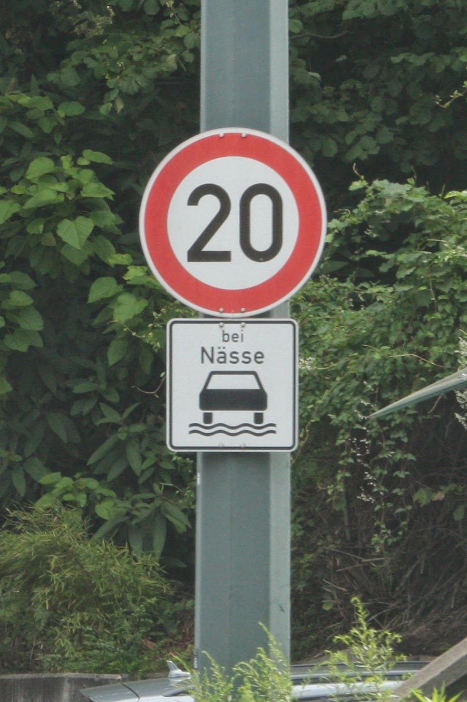

# **Traffic Sign Recognition** 

## Writeup

---

**Build a Traffic Sign Recognition Project**

The goals / steps of this project are the following:
* Load the data set (see below for links to the project data set)
* Explore, summarize and visualize the data set
* Design, train and test a model architecture
* Use the model to make predictions on new images
* Analyze the softmax probabilities of the new images
* Summarize the results with a written report


[//]: # (Image References)

[image1]: ./examples/visualization.jpg "Visualization"
[image2]: ./examples/grayscale.jpg "Grayscaling"
[image3]: ./examples/random_noise.jpg "Random Noise"
[image4]: ./examples/placeholder.png "Traffic Sign 1"
[image5]: ./examples/placeholder.png "Traffic Sign 2"
[image6]: ./examples/placeholder.png "Traffic Sign 3"
[image7]: ./examples/placeholder.png "Traffic Sign 4"
[image8]: ./examples/placeholder.png "Traffic Sign 5"

## Rubric Points
### Here I will consider the [rubric points](https://review.udacity.com/#!/rubrics/481/view) individually and describe how I addressed each point in my implementation.  

---
### Writeup / README

Done. Link to my [project code](https://github.com/AlxVoropaev/CarND-Traffic-Sign-Classifier-Project/blob/master/Traffic_Sign_Classifier.ipynb)

### Data Set Summary & Exploration

#### 1. Provide a basic summary of the data set. In the code, the analysis should be done using python, numpy and/or pandas methods rather than hardcoding results manually.

Summary statistics are in cell-2:
* Number of training examples = 34799
* The size of the validation =  4410
* Number of testing examples = 12630
* Image data shape = (32, 32, 3)
* Number of classes = 43

#### 2. Include an exploratory visualization of the dataset.

Distribution train samples between classes:


Draw train sample for each class:


### Design and Test a Model Architecture

#### 1. Describe how you preprocessed the image data. What techniques were chosen and why did you choose these techniques? Consider including images showing the output of each preprocessing technique. Pre-processing refers to techniques such as converting to grayscale, normalization, etc. (OPTIONAL: As described in the "Stand Out Suggestions" part of the rubric, if you generated additional data for training, describe why you decided to generate additional data, how you generated the data, and provide example images of the additional data. Then describe the characteristics of the augmented training set like number of images in the set, number of images for each class, etc.)

Image preprocessing is located in Dataset class (cell-6)
- __init__ - `Dataset` constructor, where preprocessing begins
    - compute features for each input input using `_get_features_` method.
    - compute normalization constants (mean and std) or take it from params (for test and valid sets)
    - do normalization as `X = (X-mead)/(std+0.00001)`
- _get_features_ - computes features for given image/images
    - fix dark image using `_fix_dark` method
    - convert to float in [0;1] range
    - extend 3 RGB-channels by 3 LAB-channels
- `_fix_dark` - fix dark images
    - convert image to LAB color space
    - for L (lightness) apply CLAHE normalization
    - convert back to RGB and return

When we take image using __getitem__ we additionally augment image using `_augment_` method as following:
    - randomly rotate image using `scipy.ndimage.rotate` in range [-5;+5] degree
    - randomly shift image using `scipy.ndimage.shift` in rage [-5;+5] in both directions

Example, how dataset works:
- RGB image of first 3 channels (after augmentation and normalization, you can see rotation and shift)
- LAB images (3 images)
- Image after dark correction
- Original image


#### 2. Describe what your final model architecture looks like including model type, layers, layer sizes, connectivity, etc.) Consider including a diagram and/or table describing the final model.

My final model is defined in (cell-8):


| Layer         		|     Description	        					| 
|:---------------------:|:---------------------------------------------:| 
| Input         		| 32x32x6 RGB+LAB image   						|
| Convolution 3x3     	| 1x1 stride, same padding, outputs 32x32x32 	|
| RELU					|												|
| Max pooling	      	| 2x2 stride,  outputs 16x16x32 				|
| Convolution 3x3     	| 1x1 stride, same padding, outputs 16x16x64 	|
| RELU					|												|
| Max pooling	      	| 2x2 stride,  outputs 8x8x64    				|
| Convolution 3x3     	| 1x1 stride, same padding, outputs 8x8x128 	|
| RELU					|												|
| Max pooling	      	| 2x2 stride,  outputs 4x4x128    				|
| Convolution 3x3     	| 1x1 stride, same padding, outputs 4x4x512 	|
| RELU					|												|
| Max pooling	      	| 2x2 stride,  outputs 2x2x512    				|
| Max pooling	      	| 2x2 stride,  outputs 1x1x512    				|
| Flatten 	      	    | outputs 512    				                | 
| Dropout               | rate 0.3                                      |
| Linear                | 512x256 outputs 256                           |
| ReLU                  |                                               |
| dropout               | rate 0.3                                      |
| Linear                | 256x43 output 43                              |

Initialization like in pytorch, but He may be better due to ReLU.

#### 3. Describe how you trained your model. The discussion can include the type of optimizer, the batch size, number of epochs and any hyperparameters such as learning rate.

To train the model (cell-11), I used:
- `tf.nn.softmax_cross_entropy_with_logits_v2` cross entropy loss with integrated softmax
- `tf.train.MomentumOptimizer` with learning_rate=0.001, momentum=0.99, use_nesterov=True
- batch size 64
- number of epoch is 19, I stoped training since learning stoped on validation.
- after epoch 5 I enable augmentation
- at each epoch I save validation accuracy and draw plot in next cell
- at each epoch I save checkpoint to restore further

Best epoch was 15, I taked it as reference for further research.

Plot of validation accuracy during training:


#### 4. Describe the approach taken for finding a solution and getting the validation set accuracy to be at least 0.93. Include in the discussion the results on the training, validation and test sets and where in the code these were calculated. Your approach may have been an iterative process, in which case, outline the steps you took to get to the final solution and why you chose those steps. Perhaps your solution involved an already well known implementation or architecture. In this case, discuss why you think the architecture is suitable for the current problem.

My final model results were:
* training set accuracy of 0.9955458490357783
* validation set accuracy of 0.9612244900932658 
* test set accuracy of 0.957561361685879

If an iterative approach was chosen:
* What was the first architecture that was tried and why was it chosen?
    * Initial architecture was with 3 convolution layers, without final pooling to 1x1x... and withot dropouts
* What were some problems with the initial architecture?
    * It starts to overfit too early and accuracy was about 88%
* How was the architecture adjusted and why was it adjusted?
    * I add one more convolution layer to reduce spactial dimentions (to 2x2) and increase features number (from 128 to 512)
    * I add final 2x2 maxpooling to remove spatial dimentions and reduce overfiting in linear layers
    * I add dropout to decrease overfiting and create features more robust
* Which parameters were tuned? How were they adjusted and why?
    * Only learning rate. Initially it was to high and model started to overfit too early.
* What are some of the important design choices and why were they chosen? For example, why might a convolution layer work well with this problem? How might a dropout layer help with creating a successful model?
    * Convolutions good for images, wher we can recognize features at diffetent levels (corners, lines, triangles) and gives us some spatial robustness (images can be shifted)
    * Dropout helps make more robust and less overfitted features. There are a lot of theory how it works, but my favorite explanation is thad dropout creates virtual ensamble of weak model and works like random forest.


### Test a Model on New Images

#### 1. Choose five German traffic signs found on the web and provide them in the report. For each image, discuss what quality or qualities might be difficult to classify.

Here are five German traffic signs that I found on the web:

    


I tried to find difficult images (but it is not easy). After crop and resize I received following images:


- Image 0. Has paint on sing that was not in train set.
- Image 1. Belongs to rare class
- Image 2. Sign is tilted and broken
- Image 3. Sing is covered by snow
- Image 4. Bad crop

I specially corrut image 4 buy creation unusual crop. I expect the problem with the image.

#### 2. Discuss the model's predictions on these new traffic signs and compare the results to predicting on the test set. At a minimum, discuss what the predictions were, the accuracy on these new predictions, and compare the accuracy to the accuracy on the test set (OPTIONAL: Discuss the results in more detail as described in the "Stand Out Suggestions" part of the rubric).

All images except last one is recognized correctly. The last image was not recognized due to crop that is unusual for train set. I dumped images of the same class from test set that were not recognized. As you can see one image is almost invisible, the second one is croped in the same way. For this alogorith crop quality is critical.

Images from test set:


#### 3. Describe how certain the model is when predicting on each of the five new images by looking at the softmax probabilities for each prediction. Provide the top 5 softmax probabilities for each image along with the sign type of each probability. (OPTIONAL: as described in the "Stand Out Suggestions" part of the rubric, visualizations can also be provided such as bar charts)

The code for making predictions on my final model is located in the last cell of the Ipython notebook.

```
Idx: 0, Right answer 17
	 top_k predict: [17 14 12 10 22]
	 top_k logits: [46.935005 22.91189  21.124802 17.772957 17.485392]
	 top_k probs: [1.0000000e+00 3.6888725e-11 6.1769062e-12 2.1631335e-13 1.6225397e-13]
Idx: 1, Right answer 0
	 top_k predict: [0 9 8 4 1]
	 top_k logits: [44.433464 22.745565 19.988111 17.63213  16.865602]
	 top_k probs: [1.0000000e+00 3.8112313e-10 2.4183450e-11 2.2926004e-12 1.0651968e-12]
Idx: 2, Right answer 18
	 top_k predict: [18 26 27 19 24]
	 top_k logits: [22.341448 16.421923 12.527188 12.307601 11.521704]
	 top_k probs: [9.9720204e-01 2.6789589e-03 5.4513541e-05 4.3766198e-05 1.9944722e-05]
Idx: 3, Right answer 18
	 top_k predict: [18 26 27 24 19]
	 top_k logits: [23.260136  10.981747   8.451612   7.3351912  6.643457 ]
	 top_k probs: [9.9999428e-01 4.6511564e-06 3.7045683e-07 1.2130599e-07 6.0738749e-08]
Idx: 4, Right answer 40
	 top_k predict: [35 33 34 37 40]
	 top_k logits: [12.180922   8.317265   7.7072577  7.251892   6.897758 ]
	 top_k probs: [0.9528735  0.02000186 0.01086795 0.00689263 0.00483712]
```

As you can see in all cases except the last one models works with high confidence (about 99%). In the last case it do prediction with prob 95% that is not high for this model.

